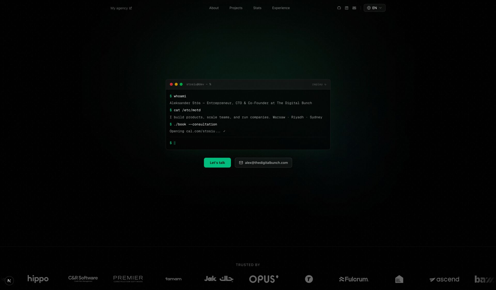

# nextjs-developer-portfolio

[](https://github.com/Stosiu/nextjs-developer-portfolio/actions/workflows/ci.yml)
[](https://github.com/Stosiu/nextjs-developer-portfolio/releases/latest)
[](https://nextjs.org/)
[](https://typescriptlang.org/)
[](https://tailwindcss.com/)
[](https://pnpm.io/)
[](https://vercel.com/new/clone?repository-url=https%3A%2F%2Fgithub.com%2FStosiu%2Fnextjs-developer-portfolio&env=NEXT_PUBLIC_SITE_URL&envDescription=Your%20deployed%20site%20URL%20(optional%20-%20used%20for%20SEO)&envLink=https%3A%2F%2Fgithub.com%2FStosiu%2Fnextjs-developer-portfolio%23environment-variables&project-name=developer-portfolio&repository-name=developer-portfolio)

A developer portfolio that doesn't look like every other developer portfolio. Built with Next.js 16, TypeScript, Tailwind CSS v4, and Framer Motion. Dark theme only — there is no light mode, and that's a feature. Ships with i18n (English, Polish, Arabic with full RTL), a live stats dashboard pulling from GitHub and Spotify, and enough Easter eggs to keep curious devs right-clicking for a while.

Fork it, swap the config files, and make it yours.

**Live demo:** [stosiu.dev](https://stosiu.dev) (the author's personal site)



> ```
> // sharing is caring
> ```
>
> I built this for myself, then realized it would be selfish to keep it private.
> Every developer deserves a portfolio that doesn't make them cringe.
> So here it is — the same template that runs my own site, open for anyone to grab.
>
> Good luck, use it well, make it yours, and if you build something cool with it — I'd love to see it.
>
> — [@Stosiu](https://github.com/Stosiu)

## Table of Contents

- [Tech Stack](#tech-stack)
- [Features](#features)
- [Easter Eggs](#easter-eggs)
- [Getting Started](#getting-started)
- [Personalizing](#personalizing)
- [Environment Variables](#environment-variables)
  - [Canonical URL](#canonical-url)
  - [Google Analytics](#google-analytics)
  - [Vercel Speed Insights](#vercel-speed-insights)
  - [GitHub Token](#github-token)
  - [Vercel Blob (AI stats)](#vercel-blob-ai-stats-only)
  - [Spotify](#spotify)
- [Internationalization (i18n)](#internationalization-i18n)
  - [How it works](#how-it-works)
  - [Adding a language](#adding-a-language)
  - [Removing a language](#removing-a-language)
  - [RTL support](#rtl-support)
- [Analytics & Privacy](#analytics--privacy)
- [Stats Dashboard](#stats-dashboard)
- [Scripts](#scripts)
- [Project Structure](#project-structure)

## Tech Stack

- **Framework:** Next.js 16 (App Router, React 19)
- **Language:** TypeScript
- **Styling:** Tailwind CSS v4, shadcn/ui
- **i18n:** next-intl — English, Polish, Arabic (RTL)
- **Animations:** Framer Motion
- **Package Manager:** pnpm

## Features

- **Interactive terminal hero** — a real typing animation with command replay. Yes, a terminal on a website. At least it's not a blockchain.
- **Floating cursor comments** — `// code-style annotations` that follow your cursor around the page
- **Canvas dot grid** — background with a mouse proximity glow effect
- **Live stats dashboard** — real GitHub contributions, AI token usage from Claude Code, and Spotify now-playing
- **Scrolling logo marquee** with client brands
- **Project showcase** with gradient-bordered cards
- **Work experience timeline** — because `years_of_experience++` needs context
- **Full i18n** with RTL support for Arabic
- **Dark theme only** — non-negotiable (you can try toggling it off in the settings panel, but...)
- **Accessible** — skip-nav, ARIA labels, respects `prefers-reduced-motion`
- **GDPR cookie consent** — opt-in analytics with consent banner and privacy policy page
- **Event tracking** — CTA clicks, project clicks, language switches, scroll depth, section views (only when analytics enabled)

## Easter Eggs

The site has a few hidden things for people who like poking around. I won't spoil all of them, but:

- Try pressing **⌘ ,** (or **Ctrl ,** on Windows/Linux)
- Right-click anywhere
- Read the console log when the page loads
- Watch for the floating comments — they change per section

There might be more. `// no NDA was harmed in the making of this`

## Getting Started

```bash
pnpm install
cp .env.example .env  # fill in what you need (all optional)
pnpm dev
```

Open [http://localhost:3000](http://localhost:3000).

## Personalizing

All personal data is centralized — edit these files to make it yours:

| File | What to change |
|---|---|
| `src/config/site.ts` | Name, email, social links, booking URL, agency info |
| `src/config/experience.ts` | Work history (structural data: company names, URLs, icons) |
| `src/config/logos.ts` | Client logos for the scrolling marquee |
| `src/config/companies.ts` | Footer company registrations |
| `src/lib/data.ts` | Project entries (titles, tech stacks, images) |
| `messages/{en,pl,ar}.json` | All user-facing text including experience & project descriptions |
| `src/app/globals.css` | Accent color (`--color-brand-*` variables and `--accent-rgb`) |
| `src/data/stats.json` | Auto-generated via upload scripts, or edit manually |

## Environment Variables

Copy `.env.example` to `.env` and fill in only what you need. **All variables are optional** — missing values silently disable the corresponding feature with no errors or broken UI.

```bash
cp .env.example .env
```

### Canonical URL

| Variable | Purpose |
|---|---|
| `NEXT_PUBLIC_SITE_URL` | Overrides the canonical URL used in SEO metadata, sitemaps, and robots.txt |

If not set, falls back to the `url` field in `src/config/site.ts`.

### Google Analytics

| Variable | Purpose |
|---|---|
| `NEXT_PUBLIC_GA_ID` | Google Analytics 4 measurement ID (e.g. `G-XXXXXXXXXX`) |

When set: loads GA (with `anonymize_ip`), shows a GDPR consent banner on first visit, renders privacy policy and cookie settings links in the footer, adds the GA CSP domains, and tracks events (CTA clicks, project clicks, language switches, scroll depth, section views).

When missing: no analytics scripts, no consent banner, no privacy/cookie links. Zero overhead.

### Vercel Speed Insights

| Variable | Purpose |
|---|---|
| `NEXT_PUBLIC_SPEED_INSIGHTS` | Set to `1` to enable Vercel Speed Insights (Web Vitals collection) |

No cookies, no PII — collects Core Web Vitals only. Works only on Vercel deployments.

### GitHub Token

GitHub stats are fetched server-side and cached for 1 hour via ISR. You need a token with `read:user` scope.

If you have the [GitHub CLI](https://cli.github.com/) installed and authenticated:

```bash
gh auth token
```

Otherwise, create a [fine-grained PAT](https://github.com/settings/tokens?type=beta) or [classic token](https://github.com/settings/tokens) with `read:user` scope.

### Vercel Blob (AI stats only)

AI usage stats are parsed from local Claude Code session files (`~/.claude/projects/**/*.jsonl`) and uploaded to Vercel Blob via `pnpm upload:ai`.

1. Create a Blob store in your [Vercel dashboard](https://vercel.com/dashboard/stores)
2. Copy the `BLOB_READ_WRITE_TOKEN` from the store settings
3. Set `REVALIDATE_SECRET` to a random string (e.g. `openssl rand -base64 32`) — used to trigger ISR revalidation after upload
4. Set `SITE_URL` to your deployed URL (e.g. `https://your-site.vercel.app`)

### Spotify

1. Create an app at [developer.spotify.com/dashboard](https://developer.spotify.com/dashboard)
2. Copy the **Client ID** and **Client Secret** into `.env`
3. In app settings, add a redirect URI (e.g. `https://your-site.vercel.app/callback`)
4. Open this URL in your browser (replace `YOUR_CLIENT_ID` and `YOUR_REDIRECT_URI`):

   ```
   https://accounts.spotify.com/authorize?client_id=YOUR_CLIENT_ID&response_type=code&redirect_uri=YOUR_REDIRECT_URI&scope=user-read-currently-playing%20user-read-recently-played%20user-top-read
   ```

5. Log in and authorize. You'll be redirected to a page that may not load — that's fine. Copy the `code` parameter from the URL bar.
6. Exchange the code for a refresh token:

   ```bash
   curl -s -X POST https://accounts.spotify.com/api/token \
     -d grant_type=authorization_code \
     -d code=YOUR_CODE \
     -d redirect_uri=YOUR_REDIRECT_URI \
     -d client_id=YOUR_CLIENT_ID \
     -d client_secret=YOUR_CLIENT_SECRET
   ```

7. Copy the `refresh_token` from the response into `.env` as `SPOTIFY_REFRESH_TOKEN`

## Internationalization (i18n)

### How it works

All user-facing text lives in `messages/{locale}.json`. Components use `useTranslations('namespace')` (client) or `getTranslations({locale, namespace})` (server) from [next-intl](https://next-intl.dev/). The routing config in `src/i18n/routing.ts` is the single source of truth for which locales exist — everything else (static params, sitemap, language switcher, metadata alternates) reads from it automatically.

The default locale (`en`) uses prefix-free URLs (`/`, `/privacy`). Other locales get a prefix (`/pl`, `/ar/privacy`).

### Adding a language

1. **Add the locale to routing** — edit `src/i18n/routing.ts`:
   ```ts
   locales: ['en', 'pl', 'ar', 'de'],  // add your locale
   ```

2. **Create the message file** — copy `messages/en.json` to `messages/de.json` and translate all values. The keys must stay the same.

3. **Add a label for the language switcher** — edit the `localeLabels` map in `src/components/language-switcher.tsx`:
   ```ts
   const localeLabels: Record<string, string> = {
     en: 'EN',
     pl: 'PL',
     ar: 'AR',
     de: 'DE',  // add this
   };
   ```

4. **Add an OpenGraph locale mapping** — edit `OG_LOCALE_MAP` in `src/app/[locale]/layout.tsx`:
   ```ts
   const OG_LOCALE_MAP: Record<string, string> = {
     en: 'en_US',
     pl: 'pl_PL',
     ar: 'ar_SA',
     de: 'de_DE',  // add this
   };
   ```

That's it. The sitemap, `generateStaticParams`, metadata alternates, and language switcher dropdown all derive from `routing.locales` automatically.

### Removing a language

1. Remove the locale from the `locales` array in `src/i18n/routing.ts`
2. Delete the corresponding `messages/{locale}.json` file
3. Remove the entry from `localeLabels` in `src/components/language-switcher.tsx`
4. Remove the entry from `OG_LOCALE_MAP` in `src/app/[locale]/layout.tsx`

### RTL support

RTL is determined by `locale === 'ar'` in the layout, which sets `dir="rtl"` on `<html>`. If you add another RTL locale (e.g. `he`, `fa`), update the condition in `src/app/[locale]/layout.tsx`:

```ts
const RTL_LOCALES = ['ar', 'he'];
const dir = RTL_LOCALES.includes(locale) ? 'rtl' : 'ltr';
```

RTL styling uses Tailwind's `rtl:` variant throughout — directional margins, arrow rotations, and the logo marquee direction all flip automatically.

## Analytics & Privacy

Analytics is **entirely opt-in**. Without `NEXT_PUBLIC_GA_ID`, no tracking code is loaded, no cookies are set, and no consent UI is shown.

When enabled:

- **Consent-first** — GA scripts are only injected after the user clicks "Accept" on the cookie banner
- **Privacy policy** — auto-generated at `/{locale}/privacy` covering what's collected, why, and user rights under GDPR
- **Cookie settings** — users can change their preference anytime via a link in the footer
- **IP anonymization** — `anonymize_ip: true` is always on
- **Events tracked** — booking/email CTA clicks, project link clicks, language switches, scroll depth milestones (25/50/75/100%), section views, social link clicks

Declining cookies means no GA, no cookies, no data sent to Google. The site works identically either way.

## Stats Dashboard

The stats section pulls data from three sources:

- **GitHub** — contributions, streak, and language breakdown fetched live from the GitHub GraphQL API (cached 1h via ISR, no manual upload needed)
- **AI usage** — Claude Code token usage parsed from local session files and uploaded to Vercel Blob. Run `pnpm upload:ai` after sessions to update.
- **Spotify** — now-playing / recently-played track fetched server-side at render time

```bash
pnpm upload:ai        # Parse ~/.claude session files and upload to Vercel Blob
```

To automate this daily, run the interactive setup:

```bash
pnpm setup:cron       # Schedules daily upload via launchd (macOS), crontab (Linux), or Task Scheduler (Windows)
pnpm remove:cron      # Removes the scheduled task
```

## Scripts

| Command | Description |
|---|---|
| `pnpm dev` | Start dev server |
| `pnpm build` | Production build |
| `pnpm start` | Serve production build |
| `pnpm lint` | Run oxlint |
| `pnpm typecheck` | TypeScript type checking |
| `pnpm upload:ai` | Upload AI usage stats to Vercel Blob |
| `pnpm setup:cron` | Schedule daily `upload:ai` (interactive, cross-platform) |
| `pnpm remove:cron` | Remove the scheduled task |

## Project Structure

```
src/
  app/[locale]/
    layout.tsx          # Locale layout (fonts, dir, providers, conditional analytics)
    page.tsx            # Single page with all sections
    not-found.tsx       # Custom 404
    privacy/page.tsx    # Privacy policy (linked only if GA_ID set)
  components/
    analytics-provider.tsx  # Conditional GA loading + scroll depth tracking
    cookie-consent.tsx      # GDPR consent banner
    navbar.tsx          # Sticky nav with scroll detection
    terminal.tsx        # Typing animation state machine
    cursor-comment.tsx  # Floating code comments
    interactive-dots.tsx # Canvas dot grid
    language-switcher.tsx
    sections/           # Hero, About, Logos, Projects, Stats, Experience, Footer
    stats/              # GitHub heatmap, AI tokens chart, Spotify card, etc.
    ui/                 # shadcn/ui + reusable components
  hooks/
    use-count-up.ts     # IntersectionObserver count-up animation
    use-track-section-view.ts # Section view analytics tracking
  i18n/                 # Locale config + routing
  data/
    stats.json          # Generated stats data
    stats-types.ts      # TypeScript types for stats
  lib/
    analytics.ts        # GA loader + event tracking (gated by NEXT_PUBLIC_GA_ID)
    consent.ts          # Cookie consent state (localStorage + CustomEvent)
    data.ts             # Project entries
    github.ts           # GitHub GraphQL API (server-side, ISR cached)
    spotify.ts          # Spotify API client
    stats.ts            # Stats aggregator (GitHub API + AI blob)
    format.ts           # Number/date formatting utilities
messages/
  en.json               # English
  pl.json               # Polish
  ar.json               # Arabic
scripts/
  upload-ai-stats.ts      # Upload AI usage stats to Vercel Blob
.github/workflows/
  ci.yml                  # Build + typecheck CI
```
